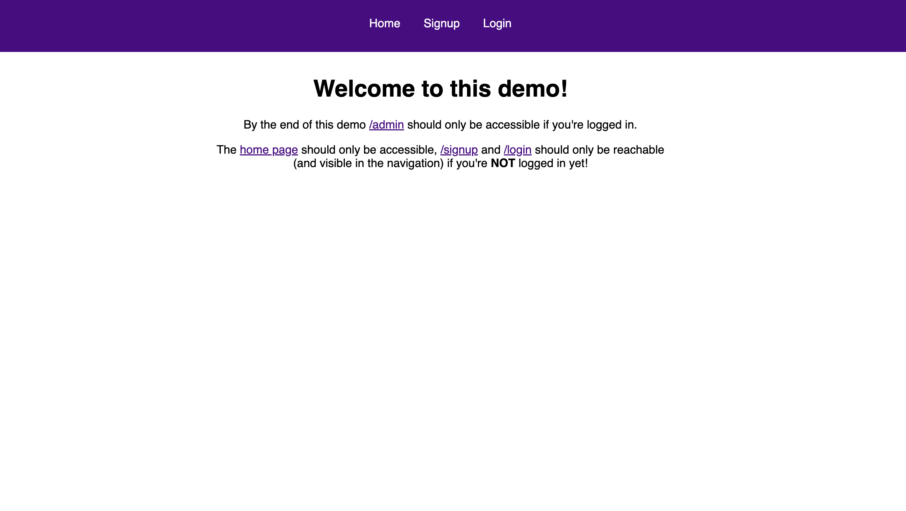

# Web-auth
A secure web authentication system, in the feature-branch

##screenshot

Web Authentication System
A secure web authentication solution for modern web applications. This repository features:

	•	User Registration: Seamlessly capture and validate user credentials.
	•	Login Authentication: Ensure secure access with encrypted password storage.
	•	Session Management: Token-based sessions for reliable user experience.
	•	Security Features: Includes password hashing, brute-force protection.
Built with scalability, modularity, and best practices for secure coding in mind.

Database
- mongoDB
